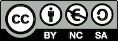

# Reading concordances in the 21st century: Teaching materials

This repository collects teaching materials created by the [RC21 project](https://www.dhss.phil.fau.eu/research/current-projects/reading-concordances-in-the-21st-century-rc21/).

All materials are available for reuse under the terms of the [CC BY-NC-SA 4.0](https://creativecommons.org/licenses/by-nc-sa/4.0/) license (see file `LICENSE`).

